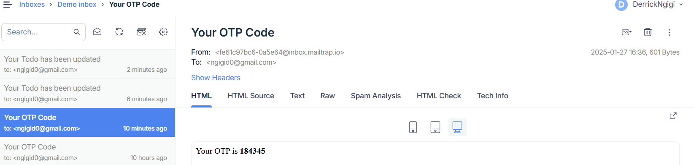

# Civic Voices

Civic Voices is a project designed to manage users and tasks while incorporating OTP verification and email notifications.

---

## Installation

1. Ensure you have [Node.js](https://nodejs.org/) installed.
2. Install dependencies using Yarn:

```bash
yarn
```

3. Start the development server:

```bash
yarn start:dev
```

4. Open your browser and navigate to:

```
http://localhost:8080/api/docs
```

---

## Features

1. **User API CRUD**:
   - Create, Read, Update, and Delete users through the API.

2. **Todo API CRUD**:
   - Manage tasks with Create, Read, Update, and Delete operations.

3. **OTP Verification**:
   - Generate and verify OTPs to enhance security.

4. **Email Notifications with Nodemailer**:
   - Send OTPs for user verification.
   - Notify users of updates or other important emails.

---

## Endpoints Overview

You can explore all endpoints and their functionality at:

```
http://localhost:8080/api/docs
```

---

## Development

Feel free to fork and contribute to the project. Ensure you adhere to best practices and write meaningful commit messages.


Evidence on email send on sandbox account



a live demo is hosted on : 

```
https://civicvoicestodo-production.up.railway.app/api/docs
```